# langlistn

Real-time audio translation and transcription to English. Captures audio from any macOS app (Zoom, Teams, Chrome, etc.) or microphone, streams it to OpenAI's Realtime API, and displays rolling English text in a terminal TUI.

Built for following meetings, calls, or videos in languages you don't speak fluently. Source language is auto-detected — just point it at an app and go.

> **Note:** Requires **macOS 15+** and an **Azure OpenAI** account with a `gpt-4o-realtime-preview` deployment.

## How it works

```mermaid
flowchart LR
    A["🎧 macOS App\n(or mic)"] -->|audio| B["Swift Helper\nScreenCaptureKit\n48→16kHz"]
    B -->|PCM16 stdout| C["Python\n16→24kHz\nbase64 PCM16"]
    C -->|WebSocket| D["OpenAI\nRealtime API"]
    D -->|text deltas| E["Textual TUI\nstreaming text\n+ cost tracker"]
```



- **Swift helper** uses ScreenCaptureKit to capture per-app audio, resamples to 16kHz PCM16 mono
- **Python** upsamples to 24kHz (OpenAI requirement), base64-encodes, streams over WebSocket
- **OpenAI Realtime API** (Azure) handles VAD, Whisper transcription, and GPT-4o translation
- **Textual TUI** streams text word-by-word as it arrives, with cost tracking

## Quick start

### 1. Clone and install

```bash
git clone https://github.com/mcinteerj/langlistn.git
cd langlistn

# Add to PATH (optional — or run ./langlistn directly)
ln -sf "$(pwd)/langlistn" ~/bin/langlistn
```

First run automatically builds the Swift helper and creates a Python venv.

### 2. Configure Azure OpenAI

1. Go to [Azure OpenAI Studio](https://oai.azure.com/)
2. Create or select a resource
3. Deploy the **gpt-4o-realtime-preview** model
4. Name the deployment `gpt-realtime` (or use `--deployment` to override)
5. Copy the API key and endpoint URL

```bash
cp .env.example .env
# Edit .env with your values:
#   AZURE_OPENAI_API_KEY=your-key
#   OPENAI_API_BASE=https://your-resource.openai.azure.com/
```

Or export directly:

```bash
export AZURE_OPENAI_API_KEY="your-key"
export OPENAI_API_BASE="https://your-resource.openai.azure.com/"
```

### 3. Grant macOS permissions

In **System Settings → Privacy & Security**, grant your terminal app (iTerm2, Terminal.app) **both**:

- **Screen & System Audio Recording**
- **System Audio Recording Only**

Both are required on macOS 15. **Restart your terminal after granting permissions.**

### 4. Run

```bash
langlistn --app "Google Chrome"
```

## Usage examples

```bash
# Translate any app's audio (auto-detects language)
langlistn --app "Google Chrome"
langlistn --app "zoom.us"
langlistn --app "Microsoft Teams"
langlistn --app "Spotify"
langlistn --app "Safari"

# Hint source language for better accuracy
langlistn --app "Google Chrome" --source ko    # Korean
langlistn --app "Google Chrome" --source ja    # Japanese
langlistn --app "zoom.us" --source zh          # Mandarin
langlistn --app "Microsoft Teams" --source fr  # French

# Use microphone instead of app capture
langlistn --mic
langlistn --mic --source de                    # German speaker
langlistn --mic --device "MacBook Pro Microphone"

# Discovery
langlistn --list-apps       # Show capturable apps
langlistn --list-devices    # Show audio input devices

# Options
langlistn --app "zoom.us" --transcript   # Show source-language transcript too
langlistn --app "zoom.us" --log out.txt  # Save translations to file
langlistn --app "zoom.us" --deployment my-gpt-realtime  # Custom deployment name
```

### TUI keybindings

| Key | Action |
|-----|--------|
| `q` | Quit |
| `t` | Toggle source-language transcript (Whisper output) |
| `l` | Toggle file logging |
| `c` | Clear display |
| `^p` | Theme palette |

### Supported languages

Auto-detects any language Whisper supports. Use `--source` to hint for better accuracy:

`ko` Korean · `ja` Japanese · `zh` Mandarin · `zh-yue` Cantonese · `th` Thai · `vi` Vietnamese · `fr` French · `de` German · `es` Spanish · `ar` Arabic · `hi` Hindi · `pt` Portuguese · `it` Italian · `ru` Russian · `id` Indonesian · `ms` Malay · `tl` Tagalog

## Cost

> **⚠️ Cost Warning**
>
> langlistn streams audio to OpenAI's Realtime API, which bills per token. Expect roughly **$0.05–0.10/minute** depending on audio density and speech pace. A 1-hour listening session could cost **$3–6**. Costs are displayed in the status bar — monitor usage in your Azure/OpenAI dashboard.

Pricing is based on gpt-4o-realtime rates (~$0.06/min audio input for voice-in/text-out).

## Troubleshooting

| Problem | Fix |
|---------|-----|
| **No audio data / silence** | Check macOS permissions (both Screen Recording AND System Audio Recording). Restart your terminal after granting. |
| **`AZURE_OPENAI_API_KEY not set`** | Copy `.env.example` to `.env` and fill in your key, or `export` it. |
| **`OPENAI_API_BASE not set`** | Set your Azure endpoint URL in `.env` or environment. |
| **Swift build fails** | Ensure Xcode Command Line Tools are installed: `xcode-select --install` |
| **App not in `--list-apps`** | The app must be running and have an active audio session. |
| **Mic permission denied** | Grant microphone access to your terminal in System Settings → Privacy & Security → Microphone. |
| **`reconnect failed after 10 attempts`** | Check your API key, endpoint URL, and deployment name. Verify the deployment is active in Azure OpenAI Studio. |

## Requirements

- **macOS 15+** (ScreenCaptureKit audio capture)
- **Python 3.11+**
- **Swift toolchain** (Xcode or Command Line Tools — `xcode-select --install`)
- **Azure OpenAI** with a `gpt-4o-realtime-preview` deployment

## Project structure

```
langlistn/
├── langlistn               # Shell wrapper (venv + Swift build + exec)
├── pyproject.toml
├── .env.example            # Configuration template
├── LICENSE                 # MIT
├── src/langlistn/
│   ├── __main__.py         # CLI (argparse)
│   ├── app.py              # Async orchestrator
│   ├── config.py           # System prompt, language map, constants
│   ├── audio/
│   │   ├── __init__.py     # AppCapture (ScreenCaptureKit via Swift helper)
│   │   └── mic_capture.py  # MicCapture (sounddevice)
│   ├── realtime/
│   │   └── __init__.py     # OpenAI Realtime API WebSocket session
│   └── tui/
│       └── __init__.py     # Textual app, LiveText streaming widget
└── swift/
    └── AudioCaptureHelper/ # Swift Package — ScreenCaptureKit capture
        ├── Package.swift
        └── Sources/main.swift
```

## License

MIT — see [LICENSE](LICENSE).
