# langlistn

Real-time audio to English text. Captures audio from any macOS app or microphone, streams it to OpenAI's Realtime API, and displays rolling English text in a terminal UI.

Transcribes English speech directly. Translates foreign languages into English automatically. Built for following meetings, calls, or videos — just point it at an app and go.

> **macOS 15+** · **Python 3.11+** · **Azure OpenAI** with `gpt-realtime-mini` or `gpt-realtime`

## How it works

```mermaid
flowchart TD
    A["🎧 App or Mic"] -->|audio| B["Swift Helper<br/>ScreenCaptureKit<br/>anti-alias + resample"]
    B -->|16kHz PCM16| C["Python<br/>silence gate<br/>upsample to 24kHz"]
    C -->|WebSocket| D["OpenAI Realtime API<br/>VAD + Whisper + GPT"]
    D -->|streaming text| E["Terminal UI<br/>live translation<br/>cost tracking"]
```



**Swift** captures per-app audio via ScreenCaptureKit, applies an anti-alias filter, and resamples to 16kHz PCM16 mono. **Python** skips silence, upsamples to 24kHz (OpenAI requirement), and streams over WebSocket. **OpenAI** handles voice activity detection, transcription, and translation when needed. The **TUI** streams text word-by-word as it arrives.

## Quick start

### Prerequisites

- macOS 15+
- Xcode Command Line Tools: `xcode-select --install`
- Python 3.11+
- An Azure OpenAI account with a `gpt-realtime-mini` (or `gpt-realtime`) deployment

### 1. Clone and install

```bash
git clone https://github.com/mcinteerj/langlistn.git
cd langlistn
```

First run automatically builds the Swift helper and creates a Python venv (~30s on first launch, instant after).

### 2. Configure Azure OpenAI

1. In [Azure OpenAI Studio](https://oai.azure.com/), deploy a **Realtime** model
2. Name the deployment `gpt-realtime-mini` (default) or `gpt-realtime`, or use `--deployment` to override
3. Copy your API key and endpoint URL

```bash
cp .env.example .env
# Edit .env:
#   AZURE_OPENAI_API_KEY=your-key
#   OPENAI_API_BASE=https://your-resource.openai.azure.com/
```

Or export directly:

```bash
export AZURE_OPENAI_API_KEY="your-key"
export OPENAI_API_BASE="https://your-resource.openai.azure.com/"
```

### 3. Grant macOS permissions

Your terminal app needs **two separate permissions** in System Settings → Privacy & Security:

1. **Screen & System Audio Recording** — lets the helper attach to app audio streams
2. **System Audio Recording Only** — required additionally on macOS 15

**Restart your terminal after granting permissions.**

### 4. Run

```bash
./langlistn --app "Google Chrome"
```

## Usage

### App audio capture

```bash
# Auto-detect language — just point at any app
./langlistn --app "Google Chrome"
./langlistn --app "zoom.us"
./langlistn --app "Microsoft Teams"
./langlistn --app "Spotify"
./langlistn --app "Safari"
./langlistn --app "Discord"
```

### Source language hints

Auto-detection works well, but hinting improves accuracy for specific languages:

```bash
./langlistn --app "Google Chrome" --source ko     # Korean
./langlistn --app "Google Chrome" --source ja     # Japanese
./langlistn --app "zoom.us" --source zh           # Mandarin
./langlistn --app "Microsoft Teams" --source fr   # French
./langlistn --app "zoom.us" --source de           # German
./langlistn --app "Google Chrome" --source es     # Spanish
```

<details>
<summary>All supported language codes</summary>

`ko` Korean · `ja` Japanese · `zh` Mandarin · `zh-yue` Cantonese · `th` Thai · `vi` Vietnamese · `fr` French · `de` German · `es` Spanish · `ar` Arabic · `hi` Hindi · `pt` Portuguese · `it` Italian · `ru` Russian · `id` Indonesian · `ms` Malay · `tl` Tagalog

Auto-detects any language Whisper supports — these codes are hints, not requirements.
</details>

### Microphone capture

```bash
# Default microphone
./langlistn --mic

# Specific microphone
./langlistn --mic --device "MacBook Pro Microphone"

# Mic with language hint
./langlistn --mic --source de
```

### Discovery

```bash
./langlistn --list-apps       # Show capturable apps (must be running)
./langlistn --list-devices    # Show audio input devices
```

### Combining options

```bash
# Full example: Korean source, show original text, log to file
./langlistn --app "Google Chrome" --source ko --transcript --log meeting.txt

# Use the full model for higher quality
./langlistn --app "Google Chrome" --deployment gpt-realtime
```

### TUI keybindings

| Key | Action |
|-----|--------|
| `q` | Quit |
| `o` | Toggle original language text (Whisper transcription) |
| `l` | Toggle file logging |
| `c` | Clear display |
| `Ctrl+p` | Theme palette |

## Cost

> **⚠️ Cost warning:** langlistn streams audio to OpenAI's Realtime API, which bills per token. With `gpt-realtime-mini` (default), expect roughly **$0.10–0.20/minute** — a 1-hour session costs **~$6–12**. The full `gpt-realtime` model is ~10× more expensive. Silence is detected client-side and not sent, which helps. Monitor costs in the status bar and your Azure dashboard.

## Troubleshooting

| Problem | Fix |
|---------|-----|
| **No audio / silence** | Grant both permissions in System Settings (Screen Recording AND System Audio Recording). Restart terminal. |
| **`AZURE_OPENAI_API_KEY not set`** | Add to `.env` or export in your shell. |
| **`OPENAI_API_BASE not set`** | Set your Azure endpoint URL in `.env` or environment. |
| **`API key rejected`** | Verify key and endpoint in Azure OpenAI Studio. |
| **Swift build fails** | Install Xcode Command Line Tools: `xcode-select --install` |
| **First run seems stuck** | Swift compilation takes ~30s on first launch. Subsequent runs are instant. |
| **App not in `--list-apps`** | The app must be running and producing audio. |
| **Mic permission denied** | Grant microphone access to your terminal in System Settings → Privacy & Security → Microphone. |
| **Reconnect loop** | Check API key, endpoint URL, and deployment name. Verify deployment is active. |

## Project structure

```
langlistn/
├── langlistn               # Shell wrapper (auto-builds venv + Swift)
├── pyproject.toml
├── .env.example
├── src/langlistn/
│   ├── __main__.py         # CLI entry point
│   ├── app.py              # Async orchestrator
│   ├── config.py           # Prompts, languages, constants
│   ├── audio/
│   │   ├── __init__.py     # App capture (ScreenCaptureKit)
│   │   └── mic_capture.py  # Mic capture (sounddevice)
│   ├── realtime/
│   │   └── __init__.py     # OpenAI Realtime API session
│   └── tui/
│       └── __init__.py     # Terminal UI (Textual)
└── swift/
    └── AudioCaptureHelper/ # Swift ScreenCaptureKit helper
```

## License

MIT — see [LICENSE](LICENSE).
